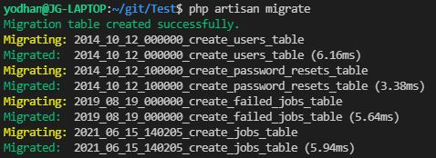
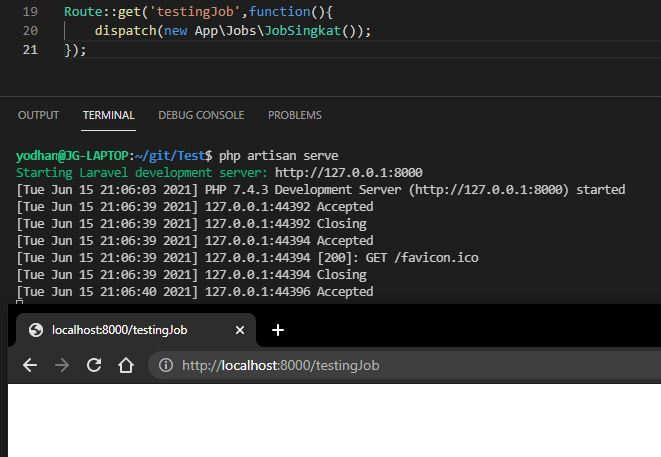

# Laravel Jobs and Queue

[Kembali](readme.md)

## Latar belakang topik

Pada aplikasi web, biasanya terdapat _task_ yang membutuhkan waktu lama untuk dijalankan, seperti :

* manipulasi gambar yang di-upload oleh client
* konversi data dari database ke bentuk file tertentu
* pengiriman e-mail ke mail server
* menggunakan service dari third-party
* dan lainnya.

Hal ini membuat user harus menunggu beberapa lama untuk dapat melanjutkan task yang lain. Dengan job queues (antrian tugas), tasks yang memakan banyak waktu tersebut dapat dipindah ke dalam _queue_ untuk dijalankan di latar belakang. Dengan demikian _response time_-nya dapat menjadi lebih cepat.

Laravel queues memberikan queueing API untuk berbagai backend, seperti Amazon SQS, Redis, dan relational database. File Konfigurasi queue disimpan di `config/session.php`.  

## Konsep-konsep
Dalam file konfigurasi `config/queue.php`, ada array konfigurasi `connections` yang menentukan koneksi ke backend queue seperti Amazon SQS, Beanstalk, atau Redis. Setiap konfigurasi connection mengandung atribut `queue`. Ini merupakan queue default untuk jobs yang dikirim ke connection tertentu. Sehingga, jika jobs dikirim tanpa menentukan queue mana tujuannya, maka jobs tersebut akan dimasukkan ke queue default tersebut.

```
use App\Jobs\ProcessPodcast;

// This job is sent to the default connection's default queue...
ProcessPodcast::dispatch();

// This job is sent to the default connection's "emails" queue...
ProcessPodcast::dispatch()->onQueue('emails');
```

Beberapa aplikasi mungkin tidak memerlukan banyak queue, cukup satu queue saja. Namun mengirimkan jobs ke beberapa queue dapat berguna untuk aplikasi yang ingin memprioritaskan atau mengelompokkan bagaimana jobs diproses. Misalnya, mengirimkan job ke queue dengan prioritas `high` akan memberikan prioritas memrosesan lebih tinggi ke job tersebut.

```
php artisan queue:work --queue=high,default
```

### Database
Ketika menggunakan database queue driver, maka perlu membuat sebuah tabel atau migrasi untuk menyimpan jobs record.

 `php artisan queue:table`
 
 `php artisan migrate`

## Settingan Awal
Sebelum membuat jobs yang dapat di queue ada 2 hal yang harus dilakukan :
1. Mengubah pengaturan di ```.env``` pada bagian ```QUEUE_CONNECTION=sync``` menjadi ```QUEUE_CONNECTION=database```. (jika tidak dilakukan maka jobs tidak akan dikirim ke queue melainkan langsung dijalankan di foreground).
2. Terhubung dengan database yang aktif.


## Langkah-langkah tutorial 
## Singkat
Pada toturial ini hanya memperlihatkan cara minimal menggunakan jobs dan queue
### S 1 : Membuat queue job

```
php artisan queue:table
```

### S 2 : Mengupdate database
```
php artisan migrate
```

### S 3 : Membuat Job
```
php artisan make:job JobSingkat
```

### S 4 : Memanggil Job
misal : menambah route di ```routes\web.php``` dan mengaksesnya
```php
Route::get('testingJob',function(){
    dispatch(new App\Jobs\JobSingkat());
});
```

### S 5 : Menjalankan Job
```
php artisan queue:work
```

## Biasa
Pada bagian ini akan mendefinisikan lebih dalam dan memberikan kemungkinan yang terjadi pada jobs tersebut
### FlowChart Jobs Simple

### Langkah pertama : Membuat Job

Secara default, semua jobs yang dapat dimasukkan queue akan disimpan di direktori `app/Jobs`. Jika direktori tersebut tidak ada, maka akan dibuat saat menjalankan perintah Artisan `make:job` :

```
php artisan make:job ProcessPodcast
```

##### Class Structure : 

```
<?php

namespace App\Jobs;

use App\Models\Podcast;
use App\Services\AudioProcessor;
use Illuminate\Bus\Queueable;
use Illuminate\Contracts\Queue\ShouldQueue;
use Illuminate\Foundation\Bus\Dispatchable;
use Illuminate\Queue\InteractsWithQueue;
use Illuminate\Queue\SerializesModels;

class ProcessPodcast implements ShouldQueue
{
    use Dispatchable, InteractsWithQueue, Queueable, SerializesModels;

    /**
     * The podcast instance.
     *
     * @var \App\Models\Podcast
     */
    protected $podcast;

    /**
     * Create a new job instance.
     *
     * @param  App\Models\Podcast  $podcast
     * @return void
     */
    public function __construct(Podcast $podcast)
    {
        $this->podcast = $podcast;
    }

    /**
     * Execute the job.
     *
     * @param  App\Services\AudioProcessor  $processor
     * @return void
     */
    public function handle(AudioProcessor $processor)
    {
        // Process uploaded podcast...
    }
}
```

### Langkah kedua : Job Middleware


### Langkah ketiga : Dispatching Jobs
Setelah selesai menulis job class, selanjutnya adalah melakukan dispatch job dengan metode `dispatch`.

```
    public function store(Request $request)
    {
        $podcast = Podcast::create(...);

        // ...

        ProcessPodcast::dispatch($podcast);
    }

```
Jika ingin memberikan condition saat melakukan dispatch, dapat menggunakan metode `dispatchIf` atau `dispatchUnless`

`ProcessPodcast::dispatchIf($accountActive, $podcast);`

`ProcessPodcast::dispatchUnless($accountSuspended, $podcast);`


### Langkah keempat : Job Batching
Sebelum memulai, diharuskan membuat database untuk membuat tabel yang berisi meta-information mengenai kumpulan job yang kita miliki, seperti persentasi penyelesaian dan sebagainya.

`php artisan queue:batches-table`

`php artisan migrate`

### Langkah kelima : Running The Queue Worker
Untuk memulai queue worker dan memproses jobs baru saat dimasukkan ke queue menggunaan command 

`php artisan queue:work`

command ini akan berjalan hingga dihentikan secara manual atau ketika terminal dimatikan.

### Langkah keenam : Dealing With Failed Jobs
Ketika job sudah melebihi maksimal attempts yang ditentukan, maka akan dimasukan ke tabel databasi `failed_jobs`. Sebelum itu, jangan lupa membuat tabel tersebut. Attempts maksimal dapat ditentukan dengan `--tries` saat menjalankan command `queue:work`

`php artisan queue:work redis --tries=3`

### Langkah ketujuh : Clearing Jobs From Queues
Saat ada job yang failed, dapat dituliskan apa yang akan terjadi pada metode `failed` di job class

```
    public function failed(Throwable $exception)
    {
        // Send user notification of failure, etc...
    }
```
### Job Events

