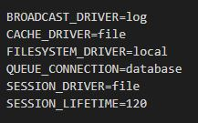
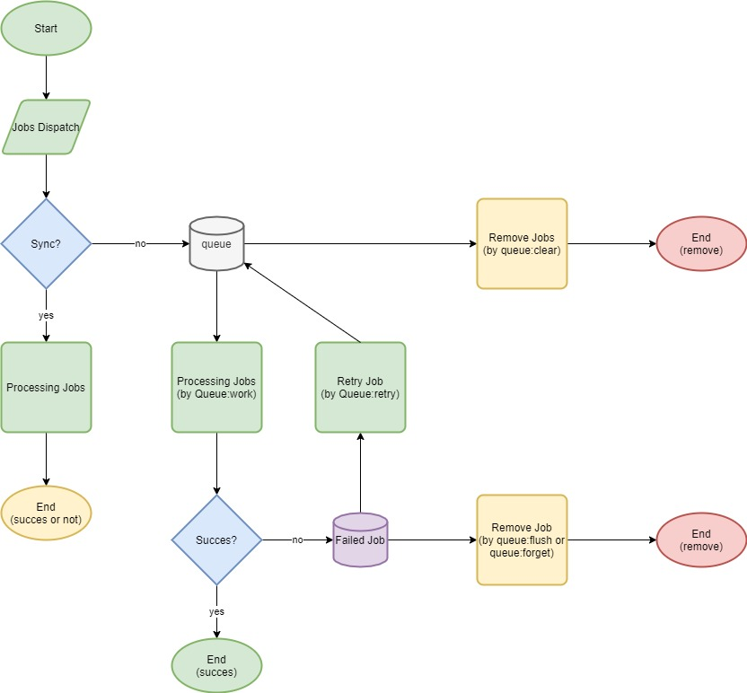

# Laravel Jobs and Queue

[Kembali](readme.md)

## Latar belakang topik

Pada aplikasi web, biasanya terdapat _task_ yang membutuhkan waktu lama untuk dijalankan, seperti :

* manipulasi gambar yang di-upload oleh client
* konversi data dari database ke bentuk file tertentu
* pengiriman e-mail ke mail server
* menggunakan service dari third-party
* dan lainnya.

Hal ini membuat user harus menunggu beberapa lama untuk dapat melanjutkan task yang lain. Dengan job queues (antrian tugas), tasks yang memakan banyak waktu tersebut dapat dipindah ke dalam _queue_ untuk dijalankan di latar belakang. Dengan demikian _response time_-nya dapat menjadi lebih cepat.

Laravel queues memberikan queueing API untuk berbagai backend, seperti Amazon SQS, Redis, dan relational database. File Konfigurasi queue disimpan di `config/session.php`.  

## Konsep-konsep
Dalam file konfigurasi `config/queue.php`, ada array konfigurasi `connections` yang menentukan koneksi ke backend queue seperti Amazon SQS, Beanstalk, atau Redis. Setiap konfigurasi connection mengandung atribut `queue`. Ini merupakan queue default untuk jobs yang dikirim ke connection tertentu. Sehingga, jika jobs dikirim tanpa menentukan queue mana tujuannya, maka jobs tersebut akan dimasukkan ke queue default tersebut.

```
use App\Jobs\JobSingkat;

// This job is sent to the default connection's default queue...
JobSingkat::dispatch();

// This job is sent to the default connection's "emails" queue...
JobSingkat::dispatch()->onQueue('emails');
```

Beberapa aplikasi mungkin tidak memerlukan banyak queue, cukup satu queue saja. Namun mengirimkan jobs ke beberapa queue dapat berguna untuk aplikasi yang ingin memprioritaskan atau mengelompokkan bagaimana jobs diproses. Misalnya, mengirimkan job ke queue dengan prioritas `high` akan memberikan prioritas memrosesan lebih tinggi ke job tersebut.

```
php artisan queue:work --queue=high,default
```

## Settingan Awal
Sebelum membuat jobs yang dapat di queue ada 2 hal yang harus dilakukan :
1. Mengubah pengaturan di ```.env``` pada bagian ```QUEUE_CONNECTION=sync``` menjadi ```QUEUE_CONNECTION=database```. (jika tidak dilakukan maka jobs tidak akan dikirim ke queue melainkan langsung dijalankan di foreground).
2. Terhubung dengan database yang aktif.



3. Membuat sebuah tabel atau migrasi untuk menyimpan jobs record.

```
 php artisan queue:table
 
 php artisan migrate
```

## Langkah-langkah tutorial 
## Singkat
Pada toturial ini hanya memperlihatkan cara minimal menggunakan jobs dan queue
### S 1 : Membuat queue job

```
php artisan queue:table
```

### S 2 : Mengupdate database
```
php artisan migrate
```

### S 3 : Membuat Job
```
php artisan make:job JobSingkat
```

### S 4 : Memanggil Job
misal : menambah route di ```routes\web.php``` dan mengaksesnya
```php
Route::get('testingJob',function(){
    dispatch(new App\Jobs\JobSingkat());
});
```

### S 5 : Menjalankan Job
```
php artisan queue:work
```

## Biasa
Pada bagian ini akan mendefinisikan lebih dalam dan memberikan kemungkinan yang terjadi pada jobs tersebut
### FlowChart Jobs Simple

### Fase 0 Membuat Queue 
#### Membuat Queue Job
dibuat sebagai letak dari queue yang akan dikerjakan, akan diletakan pada `database/migrations`
```
php artisan queue:table
```


#### Migrasi Database
mengupdate database sehingga dapat menerima job yang akan dijalankan
```
php artisan migrate
```


### Langkah Pertama : Membuat Job

Secara default, semua jobs yang dapat dimasukkan queue akan disimpan di direktori `app/Jobs`. Jika direktori tersebut tidak ada, maka akan dibuat saat menjalankan perintah Artisan `make:job` :

```
php artisan make:job PekerjaanBiasa
```


Mendefinisikan apa yang akan dilakukan jobs di fungsi handle. misal:
```php
public function handle()
    {
        echo("jobs");
    }
```

### Langkah Kedua : Memanggil Job
Jobs dapat dipanggil dengan melakukan `dispatch()` pada job tersebut 
misal : menambah route di ```routes\web.php``` dan mengaksesnya
```php
Route::get('testingJob',function(){
    dispatch(new App\Jobs\JobSingkat());
});
```


atau dengan menambahkan jobs dan memanggilnya
```php
 use App\Jobs\PerkerjaanBiasa;
```
```php
PekerjaanBiasa::dispatch();
```
additional command:
- Jobs dapat dispesifikasikan lokasi databasenya dengan `onConnection()` seperti `PekerjaanBiasa::dispatch()->onConnection('redis')` more connection on `config/queue`
- Jobs juga dapat dispesifikasikan lokasi queuenya dengan `onQueue()`seperti `PekerjaanBiasa::dispatch()->onQueue('Penting')`
- Jika mengganti `dispatch()` menjadi `dispatchSync()` maka jobs tidak akan diqueue melainkan langsung dijalankan
- Jobs dapat ditunda dengan menambahkan `delay(now()->addMinutes([number])` contoh: `PekerjaanBiasa::dispatch()->delay(now()->addMinutes(10))`

### Langkah Ketiga : Menjalankan Queued Job
Queue dapat dijalankan dengan  melakukan command sebagai berikut
```
php artisan queue:work
```


additional command:
- Jika mengganti isi dari job dan job masih berjalan maka harus melakukan `php artisan queue:restart` agar perubahan dapat dikenali worker
- Jika menjalankan `php artisan queue:listen` maka tidak perlu melakukan `queue:restart` tapi lebih lambat daripada `queue:work`
- Worker dapat dispesifikasikan queue yang akan dijalankanya dengan menambahkan `--queue='nama_queue'` contoh: `php artisan queue:work --queue=default,Penting`, jika tidak dispesifikasikan akan menjalankan `default`
- untuk database langsung menambahkan nama databasenya contoh:`php aritsan queue:work redis`
### Langkah 3.1 : Clearing Queued Job
Jika ingin membersihkan queue yang akan dijalankan maka dapat melakukan command sebagai berikut
```
php artisan queue:clear
```
### langkah Keempat : Retry Failed Job
jika pada tabel Failed Job ada queue yang ingin coba ulang dapat melakukan command sebagai berikut
```
php artisan queue:retry [id]
```
additional command:
- untuk mencoba ulang semua jobs dapat melakukan `php artisan queue:retry all`
- jobs dapat langsung diulang ketika dijalankan dengan menjalankan worker dengan `--tries=[number]` contoh : `php artisan queue:work --tries=3`

### Langkah 4.1 : Flushing Failed Job
Jika ingin membersihkan tabel Failed Job dapat melakukan command sebagai berikut
```
php artisan queue:forget [id]
```
additional command:
- untuk menghilangkan semua job yang gagal dapat menjalankan `php artisan queue:flush`

## More on Jobs

### Unique : Memastikan tidak ada jobs ganda pada queue
Job hanya akan dipush ke queue ketika tidak ada job dengan key yang sama pada queue tersebut jika ada maka tidak akan dipush 
```php
<?php

use Illuminate\Contracts\Queue\ShouldQueue;
use Illuminate\Contracts\Queue\ShouldBeUnique;

class UpdateSearchIndex implements ShouldQueue, ShouldBeUnique
{
    ...
}
```

### Middleware : Membuat Custom Logic
Jika ingin menambahkan logic sendiri maka laravel tidak mespesifikasikan path dan dapat bebas membuat pathnya misalnya `App\Middleware` atau `App\Jobs\Middleware`

### Job Chaining : Membuat Job yang berjalan urut
Job Chaining dilakukan ketika job yang dilakukan harus urut dan jika ada bagian yang gagal maka job dalam chain tidak akan dilakukan.
```php
use App\Jobs\Job1;
use App\Jobs\Job2;
use App\Jobs\Job4;
use Illuminate\Support\Facades\Bus;

Bus::chain([
    new Job1,
    new Job2,
    new Job4,
])->dispatch();
```
### Jobs Batching : membuat Jobs yang dapat dilacak
fitur ini memungkinkan mengjalankan batch dan melakukan aksi ketika batch sudah selesai dilakukan
#### 1 : Membuat Table Batch
perlu membuat tablenya telebih dahulu
```
php artisan queue:batches-table

php artisan migrate
```
#### 2 : Create Batch
perlu menambahkan`Illuminate\Bus\Batchable` dan dalam class `use Batchable`
#### 3 : Dispatch Batch
sebagai contoh:
```php
use App\Jobs\ImportCsv;
use Illuminate\Bus\Batch;
use Illuminate\Support\Facades\Bus;
use Throwable;

$batch = Bus::batch([
    new ImportCsv(1, 100),
    new ImportCsv(101, 200),
    new ImportCsv(201, 300),
    new ImportCsv(301, 400),
    new ImportCsv(401, 500),
])->then(function (Batch $batch) {
    // All jobs completed successfully...
})->catch(function (Batch $batch, Throwable $e) {
    // First batch job failure detected...
})->finally(function (Batch $batch) {
    // The batch has finished executing...
})->dispatch();

return $batch->id;
```
